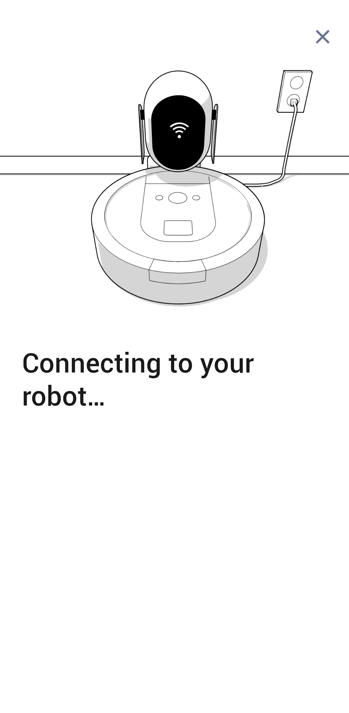

# We're having trouble connecting to your robot via Bluetooth

Recently I've attempted to connect the iRobot Roomba i7 with the iRobot® HOME App. Every time I got stuck on this screen:

only to see the error message after less than 5 minutes:

This error kept showing up despite:

- following the official [iRobot guide]
- having [Optimal firewall configurations]
- not having any [router compability issues]
- trying everything from the official [Connection Issues Troubleshooting Guide]
- and following the on screen instructions from the app to a T

## Solution
Try using a different smartphone.

[iRobot guide]: <https://homesupport.irobot.com/s/article/17734>
[Optimal firewall configurations]: <https://homesupport.irobot.com/s/article/9025>
[router compability issues]: <https://homesupport.irobot.com/s/article/10657>
[router compability issues]: <https://homesupport.irobot.com/s/article/17735>

